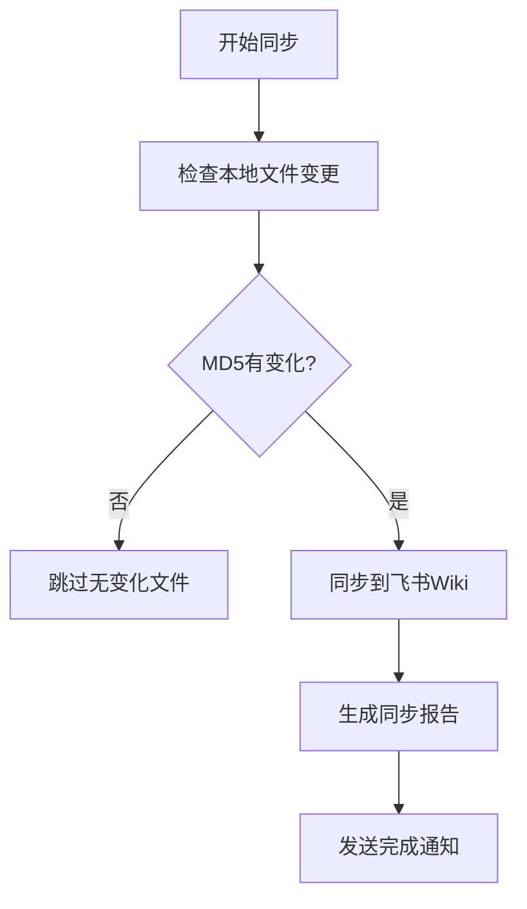

# 飞书Wiki极简备份技能

> 用户体验优先：2次交互 -> 每天自动备份

## 用户体验设计

### 第1次：发链接
```
用户：帮我备份到 https://xxx.feishu.cn/wiki/xxx
小满：✅ 已识别知识库
     [展示同步方案...]
     ⏰ 同步时间：每天 22:30
     请回复「确认」开始同步
```

### 第2次：确认
```
用户：确认
小满：✅ 已设置每天22:30自动同步
     ✅ 已写入Cron定时任务
     🔄 正在执行首次同步...
     📊 同步完成：7个文件
```

### 之后：自动运行
- 定时触发 → 同步 → 发送链接到飞书

---

## 同步方案展示（用户看到的内容）

```
📁 同步文件映射表
==================================================
本地文件                           → 飞书目录                
--------------------------------------------------
AGENTS.md                      → 核心配置/
SOUL.md                        → 核心配置/
IDENTITY.md                    → 核心配置/
USER.md                        → 核心配置/
MEMORY.md                      → 核心配置/
TOOLS.md                       → 核心配置/
HEARTBEAT.md                   → 核心配置/
memory/daily-reports           → 工作报/
--------------------------------------------------

🔄 执行流程


🛡️ 风控措施
-------------------------
• 仅同步到用户指定的Wiki目录
• 不修改其他任何文档
• 同步失败自动重试3次
```

---

## 核心功能

| 功能 | 说明 |
|------|------|
| 一句话启动 | 发Wiki链接即可 |
| 默认同步 | 核心配置(7个) + 每日工作报 |
| 自动定时 | 写入Cron每天执行 |
| 同步完成 | 发送飞书文档链接 |

## 触发关键词
- 备份、备份到、同步到（后面跟飞书Wiki链接）

## 交互命令
- `init <wiki链接>` - 首次配置
- `confirm` - 确认同步方案
- `run` - 执行同步
- `status` - 查看状态
- `plan` - 查看同步方案